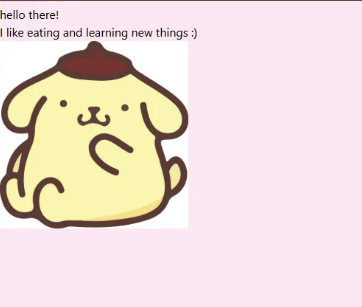

# my very own website!
HI ALL this is my very first project(with updates!) for reference, this was the original one i submitted following the macondo workshop guide: 
soo we've come a decent way! This is still one of my first few projects so I'm not sure I'm writing the readme correctly :') 

here are some things i learned through this project -->
* a deeper knowledge of html(nav barrr)
* css(margin debugging)
* and js(including writing functions!)
##
### highlights
i really enjoyed diving deeper into js. i've learned some python in the past, so it was fun seeing the similarities between the 2 languages and helped me learn js faster. it was really satisfying to see my creation come to life(LIKE MY COOKIE CLICKER. HIGHLIGHT OF MY WEBSITE!!! DEFINITELY CHECK IT OUT 🍪) I also loved playing around with the different animations! The quotes on the cookie clicker change color slowly every time a new quote shows up :D

### challenges
one of the hardest parts for me was definitely the css / formatting. it's one thing to imagine the layout, but another to actually write it out and deal with margins, overlaps, divs, etc. it was really confusing for me and kept messing me up. however i think through this project i have gained a better understanding of css as a whole! 

ok thanks for reading and looking through my website! <3